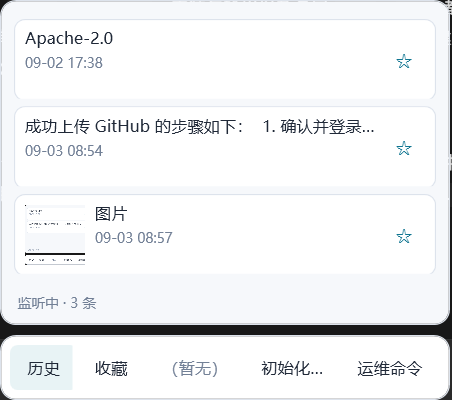

# PromptFlow

[English](#english) | 简体中文

PromptFlow 是一款面向 Windows 的本地剪贴板助手。它会在后台保存文本、富文本和图片剪贴板内容，让你可以通过全局快捷键快速检索、整理并粘贴常用内容。

## 功能

- 监听文本、富文本和图片剪贴板内容，并自动去重。
- 通过全局快捷键唤出历史面板，选择内容后粘贴回此前使用的应用。
- 用文件夹收藏、整理常用内容；支持拖放排序、快捷槽和锁定。
- 支持图片缩略图、悬停预览、托盘菜单和每个应用的剪贴板监听排除列表。
- 数据默认保存在 `%LOCALAPPDATA%\PromptFlow\data`，可在设置中改到其他目录。

## 界面

| 历史记录 | 收藏夹和快捷槽 |
| --- | --- |
|  |  |


## 安装和使用

1. 从 [Releases](https://github.com/snow-sirius/promptflow/releases) 下载 `PromptFlow-Setup.exe` 并运行。
2. 安装完成后，应用会驻留在系统托盘并开始监听剪贴板。
3. 默认快捷键为 `Ctrl+鼠标侧键 1`。可在设置中改为 `Ctrl+XButton2` 或键盘组合，例如 `Ctrl+Shift+P`。

安装包为 Windows x64 自包含版本，无需预先安装 .NET Runtime。卸载时默认保留用户数据；在卸载程序中选中“删除用户数据”才会移除它们。

## 从源码构建

**要求：** Windows、.NET SDK 8.0 和 Inno Setup 6（仅构建安装包时需要）。

```powershell
dotnet restore PromptFlow\PromptFlow.csproj
dotnet build PromptFlow\PromptFlow.csproj
dotnet test PromptFlow.Tests\PromptFlow.Tests.csproj
dotnet publish PromptFlow\PromptFlow.csproj -c Release -r win-x64 --self-contained true -o publish
```

使用 Inno Setup 生成安装包：

```powershell
& 'C:\Users\Huawei\AppData\Local\Programs\Inno Setup 6\ISCC.exe' installer\PromptFlow.iss
```

产物位于 `installer\output`，不会提交到 Git 仓库。

## 许可证

本项目采用 [MIT License](LICENSE) 发布。

---

<a id="english"></a>

## English

PromptFlow is a local clipboard assistant for Windows. It keeps text, rich text, and image clipboard entries in the background, then lets you retrieve, organize, and paste them with a global shortcut.

### Features

- Monitors text, rich text, and image clipboard entries with deduplication.
- Opens a history panel from a global shortcut and pastes an entry back into the previously active application.
- Organizes frequent entries in folders with drag-and-drop ordering, shortcut slots, and locks.
- Includes image thumbnails, hover previews, a tray menu, and per-application clipboard exclusions.
- Stores data locally at `%LOCALAPPDATA%\PromptFlow\data` by default; the location is configurable in Settings.

### Install and use

1. Download and run `PromptFlow-Setup.exe` from [Releases](https://github.com/snow-sirius/promptflow/releases).
2. After installation, PromptFlow runs in the system tray and starts monitoring the clipboard.
3. The default shortcut is `Ctrl+Mouse Button 1`. Change it in Settings to `Ctrl+XButton2` or a keyboard shortcut such as `Ctrl+Shift+P`.

The Windows x64 installer is self-contained, so it does not require a separate .NET Runtime installation. Uninstalling preserves user data unless **Delete user data** is selected in the uninstaller.

### Build from source

**Requirements:** Windows, .NET SDK 8.0, and Inno Setup 6 (only to build the installer).

```powershell
dotnet restore PromptFlow\PromptFlow.csproj
dotnet build PromptFlow\PromptFlow.csproj
dotnet test PromptFlow.Tests\PromptFlow.Tests.csproj
dotnet publish PromptFlow\PromptFlow.csproj -c Release -r win-x64 --self-contained true -o publish
```

Build the installer with Inno Setup:

```powershell
& 'C:\Users\Huawei\AppData\Local\Programs\Inno Setup 6\ISCC.exe' installer\PromptFlow.iss
```

The installer is written to `installer\output` and is intentionally not committed to Git.

### License

This project is released under the [MIT License](LICENSE).
